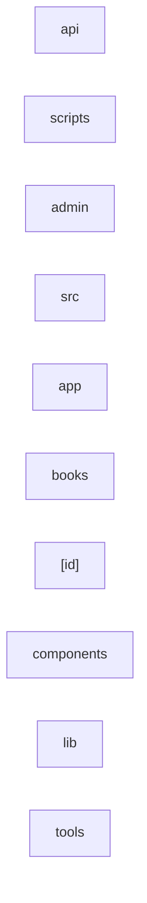

# 2. 見取り図 <!-- b_y5pce933 -->

> [!NOTE]
> **未生成**
> この節はまだ生成されていません。mitori の「生成する」で作られます。 <!-- b_yy6fghf6 -->

```mermaid
flowchart LR
  services-api["api"]
  scripts["scripts"]
  services-api-cmd-admin["admin"]
  tools-indexer-rs-src["src"]
  web-app["app"]
  web-app-api-books["books"]
  web-app-api-books-id["#91;id#93;"]
  web-components["components"]
  web-lib["lib"]
  web-tools["tools"]
```
<!-- b_fs161v6r -->
